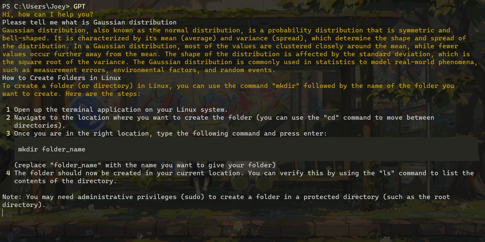

# TerminalGPT

[]()  

TerminalGPT 可以让你在终端中使用 chatgpt



## 使用方法

> 使用本项目前，请确保已安装`python3`并将其添加到系统环境变量中。

1. 从GitHub下载代码，并进入目录

   ```bash
   git clone https://github.com/ForestTrees/terminalGPT.git
   ```

2. 安装必要的第三方包：

   ```bash
   pip install openai
   pip install colorama
   ```

3. 创建一个名为`config.ini`的文件并写入以下信息：

   ```ini
   [Section1]
   key = <Your openAI key>
   language = en
   ```

   申请API密钥： https://platform.openai.com/account/api-keys 

   `language` 目前支持英文（en）

4. 使用 `python` 运行项目

   ```bash
   python main.py
   ```

## 快捷启动方式 (Windows)

1. 将本项目的文件夹路径添加到系统环境变量Path中

2. 修改`GPT.bat`为自己的路径

   ```bat
   @echo off
   python.exe <Your Path>\main.py
   ```

3. 直接在终端输入：`GPT`即可运行。

   也可以将`GPT.bat`修改为任意名称（不要更改`.bat`后缀），然后在终端中输入此名称即可运行程序

## 待办事项

- [x] 快速启动支持
- [ ] 多语言支持
- [ ] 开始新聊天
- [ ] 保存聊天
- [ ] 加载以前的聊天记录
- [ ] 查看个人/整体代币使用情况
- [ ] 更优雅的加载动画
- [ ] 简单问答 - 快速启动一回合制问答

## License

This project is licensed under the [MIT License](https://github.com/ForestTrees/terminalGPT/blob/main/LICENSE).
