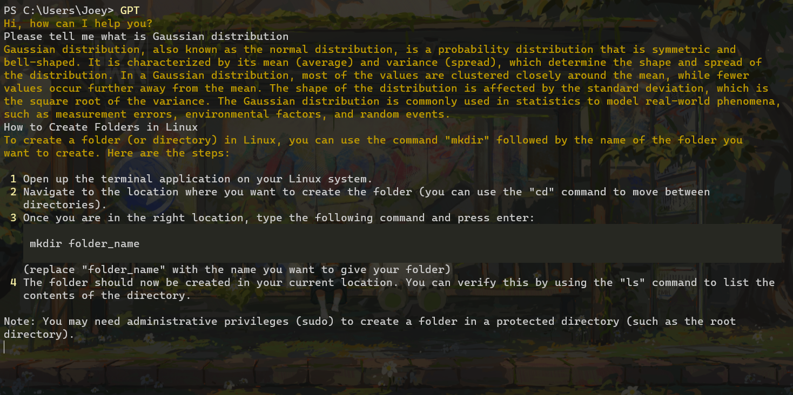

# TerminalGPT

[]()  

[[English]](https://github.com/ForestTrees/TerminalGPT) [[中文]](https://github.com/ForestTrees/TerminalGPT/blob/main/README-CN.md) 

TerminalGPT is a project that allows you to use chatgpt in the terminal



## How to use

> Please make sure that `python3` has been installed and added to the system environment variables before you use this project.

1. Clone the repo and enter the directory

   ```bash
   git clone https://github.com/ForestTrees/terminalGPT.git
   ```

2. Install the necessary third-party packages:

   ```bash
   pip install openai
   pip install colorama
   ```

3. Open the file named `config.ini` and fill in your openAI key into the file:

   ```ini
   [Section1]
   key = <Your openAI key>
   language = en
   ```

   You can find your API key at https://platform.openai.com/account/api-keys.

   `language` Currently supports English (en)

4. Run the project with `python`

   ```bash
   python main.py
   ```

## Shortcut to run (Windows)

1. Add the folder path of this project to the system environment variable Path

2. Modify `GPT.bat` to your own path

   ```bat
   @echo off
   python.exe <Your Path>\main.py
   ```

3. Enter directly in the terminal: `GPT` to run. 

   You can also modify `GPT.bat` to any name (do not change the `.bat` suffix), and then enter this name in the terminal to run the program

## To do list

- [x] Quick start support
- [ ] Multi-language support
- [x] Start a new chat
- [ ] Save chat
- [ ] Load previous chats
- [ ] View individual/overall token usage
- [x] Load answer results verbatim
- [ ] Simple Q&A - Quick Start One-Turn Q&A

## License

This project is licensed under the [MIT License](https://github.com/ForestTrees/terminalGPT/blob/main/LICENSE).
